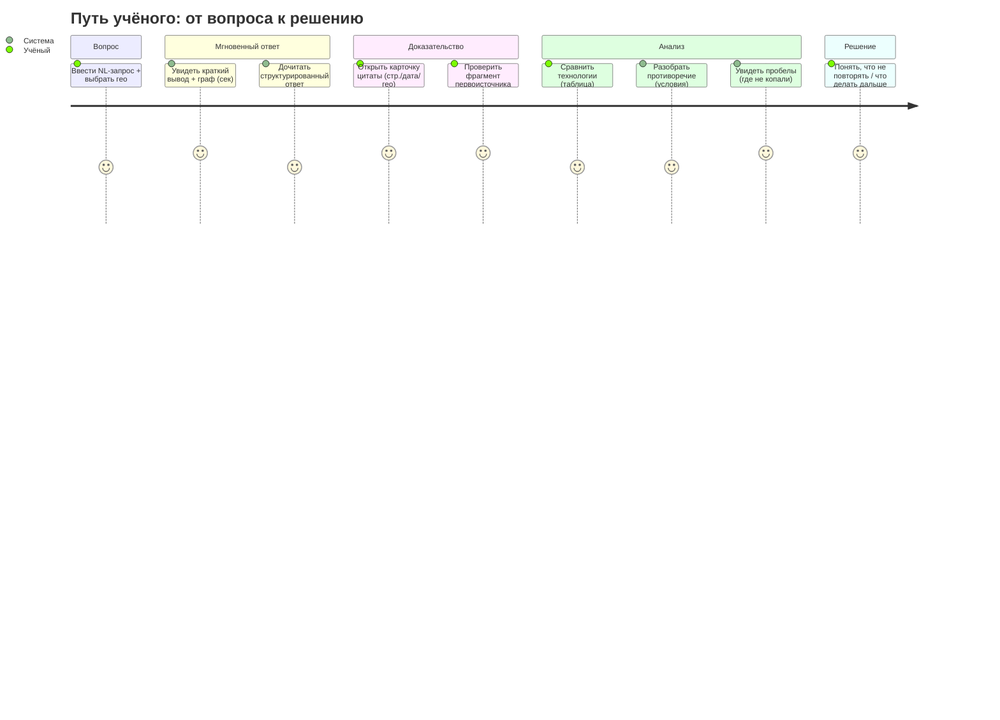

# «Научный клубок» — архитектура, бенчмарки и killer features для финала

> Аналитический материал к защите (трек-2 хакатона Норникеля).
> Составлен по прямому чтению кода ветки `main` + адверсариальной верификации 32 агентами
> (workflow `wf_7dfcf533-83b`, 1.63M токенов) + перепроверке ключевых фактов вручную.
> Дата среза: 2026-07-04.
>
> **Принцип документа:** каждое утверждение о текущем поведении подтверждено `путь:строка Символ`.
> Статусы: **IMPLEMENTED** (работает и подключено к живому пути), **PARTIAL**, **PLANNED**
> (есть архитектура, не закончено), **PROPOSED** (рекомендация), **NOT_IMPLEMENTED**.
> Отдельно для каждой возможности указано **WIRED** (достижимо из `POST /api/v1/query` или
> смонтированного роутера) или **UNWIRED** (импортируется только собственными тестами — мёртвый код).
> Бенчмарк-числа не выдуманы: реальные помечены датасетом и `n`, остальное — шаблоны «TBD».

---

## 1. Executive summary

«Научный клубок» — это **не «загрузили PDF и сделали чат»**, а работающий evidence-first
knowledge-graph над горно-металлургическим корпусом с несколькими возможностями, которых у
обычного RAG нет и которые **реально подключены** к живому пути ответа:

- **детерминированная числовая фильтрация** с проверкой размерности единиц (не LLM);
- **разбор сложного запроса** в типизированную схему (материал + процесс + числа + гео + время);
- **каждое число в ответе привязано к документу/странице/фрагменту** с датой актуализации и гео;
- **guardrail достоверности**: число без ссылки `[n]` роняет `verified=false` и `confidence≤0.5`;
- **RU↔EN нормализация синонимов** на этапе и запроса, и извлечения.

Одновременно нужно честно понимать **главную архитектурную реальность проекта**:
это **тонкий, качественный срез поверх очень большой кодовой базы**. На уровне возможностей
**85 WIRED против 33 UNWIRED (≈28 % мёртвого кода)**; в графовом/community-слое **43 из 63 модулей
(68 %) не имеют ни одного импортёра даже в тестах**. Значительная часть «фич из roadmap»
(5-канальный fusion, rerank, sparse, вся graphrag_*-фабрика, экономика, applicability, 16-tool
агент, verify-retry-петля) построена и протестирована на уровне файлов, но **не включена в
работающую систему**. Поэтому цифра трассируемости «1924/3283 задач (58.6 %)»
**систематически завышает поставленную работоспособность**.

**Три вывода, которые определяют защиту:**

1. **Есть P0-блокер, который сейчас кладёт весь API на чистом `main`** (см. §11.1). Его надо
   починить до демо. Фикс уже существует на ветке `hard_refactoring` — это порт, а не разработка.
2. **Продавать надо узкий, но настоящий сценарий** (доказательный числовой ответ на 4 отлаженных
   вопроса), а не 25 экранов. Экспертное Q&A прямо говорит: «работающий поиск + хорошие источники
   ≫ десять красивых экранов + слабые ответы».
3. **Бенчмарки теперь прогнаны на живой системе (§6.А), числа реальны и воспроизведены.** На живом
   152k-графе: приёмочный golden-suite **5/6, entity recall 100 %**; **phantom-citation rate 0.0 %**,
   цитаты со страницей **99.4 %**; guardrail срабатывает на **91.7 %** ответов; genuine_gap
   эмпирически **= 0** (подтверждает недостижимость); синтетический absence-бенч воспроизведён точно
   (macro-F1 0.636, **AUROC 0.500** — честная слабость калибровки). **Главная честная проблема —
   скорость: `/query` ≈ 9 с на 152k-графе (SLO 3–5 с не выполнен)**, при этом сам обход графа ~0.4 с.
   Устаревшее «6/6 100 %» из `docs/eval/` заменено воспроизводимым `cases.json` (закоммичен).

---

## 2. Бизнес-проблема

Боль Норникеля (по ТЗ и расшифровке Q&A) — **не отсутствие данных, а невозможность быстро
связать уже накопленные знания**. Учёный вручную ищет, переводит, проверяет источники, извлекает
числа и собирает обзор. Отсюда: потеря корпоративной памяти, повтор уже проведённых экспериментов,
споры о параметрах процессов, непонимание, где «уже копали», а где данных нет.

Ожидаемый результат запроса — **не список файлов**, а связная структура:
`вывод → эксперименты → условия → оборудование/материалы → публикации/патенты → противоречия → пробелы`,
где **каждое число проверяемо по первоисточнику**, работает сравнение российской и зарубежной
практики, а система помогает решить, **какой эксперимент имеет смысл делать следующим**.

Обязательны **многопараметрические запросы**: `материал + процесс + условия + география + период`.
Контрольные вопросы эксперты уже решали людьми и знают ожидаемый ответ (примеры: обессоливание
воды при сульфаты/хлориды 200–300 мг/л и TDS ≤ 1000 мг/дм³; распределение Au/Ag/МПГ между
медно-никелевым штейном и шлаком за 5 лет). Обзоры (`обзоры`) — это **псевдо-gold**: заголовок = вопрос,
содержание = эталонный ответ.

---

## 3. Текущий уровень реализации

### 3.1 Живой путь (то, что реально исполняется на запрос)

```
POST /api/v1/query            (routers/query.py:28-39)
   └─ agent_service.agent.answer_query(query, store, role, use_llm, geography)
        └─ LangGraph StateGraph (agent.py:106-118): 5 узлов, ЛИНЕЙНО, без ветвлений и retry
             preprocess → parse → retrieve → synthesize → verify → END
   ├─ n_parse (agent.py:46): query_parser.parse_query — БЕЗ LLM, regex+таксономия →
   │     entities, numeric_constraints(≤/≥/range), practice_types(гео), year_from/to
   ├─ n_retrieve (agent.py:64-89):
   │     GraphRetriever.retrieve(intent)        ← структурный граф + числ/гео/врем фильтры
   │     + community_search.global_search       ← ТОЛЬКО если intent=='global'
   │     + _get_hybrid().search(raw, limit=5)   ← ТОЛЬКО если hybrid.available()
   │     + apply_access_policy(role)
   ├─ n_synthesize (agent.py:91): build_answer → AnswerPayload{markdown,citations,graph,table,gaps,contradictions,confidence}
   └─ n_verify (agent.py:100): grounding + «числа без [n]» → cap confidence   ← ТОЛЬКО на sync /query

POST /api/v1/query/stream     (routers/query.py:42-85)
   └─ answer_query_stream → stream_answer   ← SSE: graph→table→gap→evidence→brief→token→done
                                            ← ⚠ verify НЕ вызывается (см. §11.3)
```

Демо работает на **встроенном профиле Kuzu** (`config.py:45 runtime_profile='embedded'`) и на
**~83-узловом hand-seed** (`kg_retrievers/seed.py`, автозагрузка `deps.py` при пустом хранилище),
настроенном под 4 демо-вопроса.

### 3.2 Сводная таблица возможностей (по подсистемам)

Легенда: ✅ IMPLEMENTED · ◐ PARTIAL · ○ PLANNED · ✗ NOT_IMPLEMENTED · **W**=WIRED · **U**=UNWIRED.

| Возможность | Статус | Провод | Подтверждение (`путь:строка`) |
|---|---|---|---|
| NL-запрос → структурированный цитируемый ответ | ✅ | W | `agent.py:146 answer_query`; `synthesize.py:188 build_answer` |
| Разбор многопараметрического запроса (материал/процесс/числа/гео/время) | ✅ | W | `query_parser.py:162 parse_query` (без LLM) |
| Детерминированная числовая фильтрация с проверкой размерности | ✅ | W | `graph_retriever.py:120-154 _passes_numeric` (≤,<,≥,>,=,range) |
| RU↔EN унификация синонимов (и запрос, и ингест) | ✅ | W | `taxonomy.py:67-92 load_taxonomy`; `query_parser.py:144 scan_taxonomy` |
| Цитата = doc_id + page + snippet + as_of + гео + год | ✅ | W | `synthesize.py:37-64 assign_citations`; `dto.py:99-154` |
| Guardrail «число без [n]» → verified=false, confidence≤0.5 | ✅ | W (**только sync**) | `verifier.py:80-118`; `answer_validator.py:210-247` |
| Grounding цитат по реальным узлам графа | ✅ | W (**только sync**) | `verifier.py:38-49 verify_answer` (`store.get_node`) |
| Стриминг SSE: мгновенный «краткий вывод» + токены | ✅ | W | `synthesize.py:264-319 stream_answer`; `query.py:42-85` |
| Интерактивный canvas-граф «Клубок» (drag/zoom/pan/PNG/3D) | ✅ | W | `GraphView.tsx:95-171,323-427`; MAX_NODES=600 |
| Таблица сравнения технологий (сырые числа, cited, gap-marked) | ✅ | W | `comparison.py:63-72 build_comparison`; `CompareView.tsx` |
| Версионирование факта + инвариант «не перезаписывать проверенное» (409) | ✅ | W | `fact_versions_store.py:316-420 revise`; `node_versioning.py:44-70 bump_version` |
| LLM-арбитр противоречий (genuine/context_dependent/resolved/insufficient) | ✅ | W (**отд. экран**) | `contradiction_analysis.py:122-169`; `POST /arbiter/{cid}/analyze` |
| HITL-уточнение (pause/resume) | ✅ | W | `hitl_chat.py:86-151`; `routers/hitl.py:97-185` |
| Нормализация валютных единиц (руб/т, $/т, млн руб; без FX) | ✅ | W | `units.py:109-131` (RUB/USD/EUR как отдельные размерности pint) |
| Загрузка новых документов → граф + подграф | ✅ | W | `documents.py`; `pipeline.IngestionPipeline.ingest` |
| Гибридный retrieval (dense+BM25 RRF-«хвост», limit=5) | ◐ | W | `hybrid.py:35-53`; `agent.py:77-87`. В embedded по умолчанию **сторы пусты → hybrid inert** |
| Отеч./зарубеж. гео-фильтр | ◐ | W | `graph_retriever.py:157-193 _passes_geo`. Работает на фактах, только если гео пропагировано |
| Временной фильтр по фактам | ◐ | W | `_passes_year:195-209` (по `source_year`; на seed фактах — no-op) |
| Извлечение таблиц **в графовые факты** | ◐ | U | таблицы парсятся (`parsers.py:144`), но `pipeline.py:159` читает только `doc.pages` — в граф не идут |
| Community/GraphRAG глобальный поиск | ◐ | W | `community_search.py:86-124 global_search` (по ключу `intent=='global'`, детерминированный overlap) |
| Пробелы в живом ответе (структурные Gap-узлы) | ◐ | W | `graph_retriever.py:269-287`; `synthesize.py:255` (без эпистемической метки) |
| 5-уровневая таксономия пробелов (KNOWN/WEAK/CONTRADICTED/TRUE_GAP/POSSIBLE_EXTRACTION_GAP) | ✗ | U | `gap_five_way.py` **отсутствует на main** (только устаревший `.pyc`) |
| Patent как сущность графа | ✗ | U | `labels.py:8-65 NodeLabel` не содержит `PATENT` (только enum на документе) |
| OCR сканов на пути ингеста | ◐ | U | `ocr_branch.py` реален, но `parse_document` его не зовёт; сканы дропаются |
| Recency-фильтр `last_n_years` на решениях | ✗ | W(no-op) | `graph_retriever.py:294-297` читает `year`, которого у solution-узлов нет |
| Verifier на стриминг-пути | ✗ | — | `answer_query_stream` не вызывает `apply_verification` (§11.3) |
| Запись исправлений факта обратно в граф | ✗ | — | `revise()` пишет только в ledger; ответы видят исходное число (§11.5) |
| Экономика (capex/opex/npv/payback) и applicability-движок | ✅ | U | `economic_indicators.py`, `applicability.py` — 0 продовых импортёров |
| 5-канальный взвешенный fusion / rerank / sparse | ✅ | U | `fusion.py:1-40`, `rerank.py`, `sparse.py` — не на живом пути |
| Golden acceptance-suite (4 обязательных вопроса, e2e) | ✗ | — | `cases.json` **отсутствует** в репозитории → `make demo` падает FileNotFoundError |

**Итог по капабилити (118 шт.):** 71 IMPLEMENTED · 34 PARTIAL · 12 NOT_IMPLEMENTED · 1 PLANNED;
**85 WIRED / 33 UNWIRED.**

---

## 4. Ключевые архитектурные решения

Ниже — 7 решений, которые действительно влияют на качество поиска, точность чисел,
доказуемость, противоречия, пробелы, скорость и UX. Очевидные технологии (FastAPI, React) опущены.

### Решение 1. Детерминированная числовая фильтрация с проверкой размерности единиц

- **Статус:** IMPLEMENTED / WIRED.
- **Проблема:** «сульфаты 200–300 мг/л, TDS ≤ 1000 мг/дм³» — семантический поиск такое не отфильтрует;
  LLM на числовом фильтре недетерминирован и галлюцинирует единицы.
- **Реализация:** `parse_query` → типизированные `ParsedConstraint` (оператор+значение+единица),
  `GraphRetriever._passes_numeric` сравнивает `value_normalized` узла с констрейнтами для `≤,<,≥,>,=`
  (5 % допуск) и `range`. **Ключевая деталь:** и констрейнт, и измерение проходят один и тот же
  `units.to_canonical`, а единица-несовпадение по размерности **пропускается (`continue`), а не
  сравнивается неправильно**.
- **Подтверждение:** `packages/kg_retrievers/src/kg_retrievers/graph_retriever.py:120-154`,
  применяется к каждому Measurement-соседу на `:259` и `:278`.
- **Почему важно:** это ровно то, что просит заказчик и что обычный RAG не делает — числа
  фильтруются, а не «похоже находятся».
- **Альтернативы:** LLM-фильтр (недетерминизм, стоимость); post-hoc regex по тексту ответа (теряет провенанс).
- **Trade-offs:** если у измерения `value_normalized=None`, оно **проходит любой** числовой констрейнт
  (`:122-123`); констрейнт без единицы обходит проверку размерности. Т.е. фильтр «щадящий» к
  недонормализованным данным.
- **Ограничения:** зависит от качества нормализации (см. дефект MPa/bar, §11.4).
- **Слайд:** «Числа фильтруются детерминированно, с проверкой размерности — не эвристикой LLM».
- **Демо:** запрос с `≤ 1000 мг/дм³` и `200–300 мг/л`, показать, что решения вне диапазона отсеяны.
- **Фраза для жюри:** «Единицы приводятся к канону с обеих сторон, поэтому мы не сравниваем мм с концентрацией — несовместимое просто не участвует в фильтре».

### Решение 2. Evidence-first: факт отделён от документа, провенанс на каждой цитате + guardrail

- **Статус:** IMPLEMENTED / WIRED (guardrail — только на sync `/query`).
- **Проблема:** доказуемость. Число в ответе должно вести к странице первоисточника; галлюцинации ловиться.
- **Реализация:** `assign_citations` кладёт каждый факт-эвиденс в типизированный `Citation` с
  `EvidenceRef(doc_id, page, text, evidence_strength)` + `geography` + `year` + `as_of` (дата
  актуализации, `YYYY-MM-DD`). Узел `n_verify` делает две проверки: (а) каждая цитата резолвится
  `store.get_node` (иначе `verified=false`, `confidence`≤покрытие); (б) число с единицей без inline
  `[n]` → `verified=false`, `confidence≤0.5` (H-5: годы/счётчики/метки исключены).
- **Подтверждение:** `synthesize.py:37-64`; `dto.py:99-154`; `verifier.py:38-118`; `answer_validator.py:210-247`.
- **Почему важно:** «проверяемость» — один из главных критериев жюри; guardrail — прямой ответ на
  «поймают ли галлюцинацию».
- **Альтернативы:** enforce цитат внутри декодирования LLM (сложнее, недетерминировано); без проверки (риск).
- **Trade-offs:** grounding **по факту существования узла, а не по смыслу** — поймает выдуманную цитату,
  но не «правильную цитату у неправильного числа»; grounding **на уровне предложения** (одна `[n]`
  «заземляет» все числа предложения).
- **Ограничения:** **на стриминг-пути verifier НЕ работает** (§11.3) — это надо чинить.
- **Слайд:** «Каждое число → документ/страница/фрагмент + дата актуализации; число без ссылки не проходит как достоверное».
- **Демо:** ответ, где guardrail пометил число без `[n]` (`confidence` упала); клик по карточке → фрагмент.
- **Фраза для жюри:** «Мы не просим верить модели — мы показываем, откуда каждое число, и режем достоверность, если ссылки нет».

### Решение 3. Граф-первый retrieval с опциональным гибридным «хвостом» (а не 5-канальный fusion)

- **Статус:** PARTIAL / WIRED.
- **Проблема:** нужен и структурный обход (материал→процесс→измерение→эвиденс), и полнотекстовый recall.
- **Реализация:** на живом пути сначала `GraphRetriever.retrieve` (структура + числ/гео/врем фильтры),
  затем **опционально** до 5 пассажей из `HybridRetriever` — **2-канальный RRF (dense Qdrant-local +
  BM25), фикс. k=60, без весов и rerank**.
- **Подтверждение:** `agent.py:64-89`; `hybrid.py:35-53`.
- **Почему важно:** структура даёт связанный ответ и числовые фильтры, которых у vector-RAG нет.
- **Альтернативы:** заявленный спецификацией **5-канальный взвешенный fusion** (`fusion.py`
  dense/sparse/bm25/graph_proximity/evidence_quality) — **написан, но мёртв** (0 живых импортёров),
  как и borda/comb/dbsf/condorcet, sparse SPLADE-lite, BM25F, MMR/cross-encoder rerank.
- **Trade-offs / честность:** в **дефолтном embedded-профиле сторы `var/qdrant` и `var/bm25` пусты**,
  поэтому `hybrid.available()==False` и «хвост» ничего не добавляет — **живой retrieval де-факто
  граф-only, пока индекс не наполнен**. Это надо либо наполнить перед демо, либо не переоценивать вслух.
- **Ограничения:** обход строго **1-hop** от кандидатов (`_neighbors:216-222`); транзитивных цепочек
  A→B→C в ответе нет, хотя `store.neighbors` поддерживает глубину 1..4.
- **Слайд:** «Граф-первый поиск: связи и числовые фильтры, а не только близость векторов».
- **Демо:** показать подграф ответа (материал↔процесс↔измерение↔эвиденс), а не список сниппетов.
- **Фраза для жюри:** «Мы строим ответ из графа, поэтому можем и фильтровать по числам, и показать связи; векторный хвост — усиление, а не основа».

### Решение 4. Двухуровневые противоречия: дешёвое обнаружение офлайн + LLM-арбитр по требованию

- **Статус:** IMPLEMENTED (арбитр) / детекция на живом ответе — PARTIAL.
- **Проблема:** источники расходятся по разным условиям (T, концентрация, масштаб) — нельзя усреднять
  и нельзя объявлять «недостоверным».
- **Реализация:** офлайн `gap_analysis._scan_contradictions` минтит `Contradiction`-узлы; по запросу
  `POST /arbiter/{cid}/analyze` LLM-арбитр (GLM-5.2) читает провенанс сторон и выносит вердикт
  `genuine|context_dependent|resolved|insufficient` + рекомендацию. Экран `ContradictionsView`
  показывает стороны с гео/годом/цитатой — **условия, а не среднее**.
- **Подтверждение:** `contradiction_analysis.py:122-169`; `contradictions.py:19-33`; `ContradictionsView.tsx`.
- **Почему важно:** «покажите противоречия с условиями» — прямое требование ТЗ; арбитр реально ловил
  артефакт извлечения (мм vs концентрация) рассуждением.
- **Альтернативы:** запускать арбитра в узле verify (ответ нёс бы вердикт сразу) — не сделано.
- **Trade-offs / честность:** **на живом ответе `/query` противоречие = просто имя** (`synthesize.py:186-188`),
  без условий и вердикта; детектор, который минтит узлы, **условно-слепой** (только одинаковое
  `property_name`+`unit`+расхождение ≥30 %, игнорирует practice_type/T/концентрацию → риск ложных
  противоречий). Арбитру на вход тоже не подают T/концентрацию.
- **Ограничения:** вердикт арбитра не пишется обратно в узел; на разных экранах разные уровни глубины.
- **Слайд:** «Расхождения — с условиями и вердиктом причины, а не усреднение».
- **Демо:** экран «Противоречия» → запустить арбитра на seed-конфликте по скорости католита.
- **Фраза для жюри:** «Разные числа — это не всегда ошибка; арбитр читает условия каждой стороны и говорит, спор это по сути или из-за разных режимов».

### Решение 5. Разделение TRUE_GAP vs extraction-miss через байесовский absence-слой

- **Статус:** PARTIAL / WIRED (только на отдельных endpoint'ах; ключевые метки недостижимы по умолчанию).
- **Проблема:** пустая ячейка (материал×свойство) — это «в мире не мерили» (TRUE_GAP) или «наш
  экстрактор пропустил» (POSSIBLE_EXTRACTION_GAP)? Различать критично («суперважно» по Q&A).
- **Реализация:** `absence_signals.classify_cell` — один шаг Байеса поверх сигналов
  (active_measurements / retracted / mentioned-without-observation) → вердикт из 6
  (present/covered/retracted/possible_miss/**genuine_gap**/abstain).
- **Подтверждение:** `absence_signals.py:149-201`; endpoint `routers/absence.py`.
- **Почему важно:** это то, чего RAG не делает вообще — карта «где не копали».
- **Альтернативы:** точная 5-уровневая таксономия ТЗ (`gap_five_way.py`) — **на main отсутствует**.
- **Trade-offs / честность (это надо знать до защиты):**
  1. **`genuine_gap` (аналог TRUE_GAP) математически недостижим** при дефолтном приоре 0.55:
     все живые вызовы дают `p_missed=0.2683 → ABSTAIN`, а `genuine_gap` требует приор ≤ 0.5263.
  2. **Один приор для двух типов пропуска + путаница mention-vs-value:** упоминание материала
     где угодно (`documents_mentioning`, не свойство-специфично) поднимает приор до 0.9 → **любое
     неизмеренное свойство помечается `possible_miss`**. Это ровно та ошибка, о которой предупреждает ТЗ.
  3. **Слой не подключён к живому `/query`** — в NL-ответе пробелы = структурные Gap-узлы, без
     эпистемической метки; калибровка захардкожена `calibrated=False, method='heuristic'`.
- **Ограничения:** метки на UI — absence-словарь (`present/genuine_gap/possible_miss/retracted`),
  а не 5-уровневая таксономия жюри.
- **Слайд:** «Отличаем “никто не мерил” от “мы могли пропустить” — байесовский priоr по покрытию».
- **Демо:** карта пробелов; **честно** назвать метки как absence-словарь, не выдавать за 5-уровневую.
- **Фраза для жюри:** «Мы не путаем реальный пробел с ошибкой извлечения — и это то место, где мы уже
  измерили собственную слабость (см. бенчмарк) и знаем, как её закрыть value-gate'ом».

### Решение 6. Версионирование факта как append-only ledger + инвариант «не перезаписывать проверенное»

- **Статус:** IMPLEMENTED / WIRED (но без записи в граф).
- **Проблема:** правка эксперта должна создавать новую версию, старая остаётся достижимой; проверенное
  не перезатирается автоматически.
- **Реализация:** `revise()` → `bump_version` (единственный живой вызов) → неизменяемый `vNNN.json` +
  хеш-цепочка Decision (SQLite); сервер бросает `409 ReviewedProtected` при попытке авто-правки
  проверенного без `curation_event_id`. Экран «Машина времени факта» рисует цепочку.
- **Подтверждение:** `fact_versions_store.py:316-420`; `node_versioning.py:44-70`; `routers/fact_versions.py:96-146`.
- **Почему важно:** демонстрирует глубину (human-in-the-loop, аудит), это «сильный плюс» по Q&A.
- **Trade-offs / честность:** `revise()` пишет **только в ledger и не пишет исправление обратно в граф**
  (единственное касание графа — чтение на `:185`). Значит **`/api/v1/query` после «исправления»
  продолжает возвращать исходное число** — «Машина времени» это провенанс-ledger, а не источник истины.
  Плюс есть **второй, несогласованный** механизм правки (curation `edit_node` перезаписывает граф
  на месте без версии).
- **Ограничения:** ledger и граф могут расходиться; ничто их не сверяет.
- **Слайд:** «Правка эксперта = новая версия, старое сохраняется; проверенное не перезатирается (409)».
- **Демо:** дважды исправить поле → счётчик версий 1→2→3, старые версии видны.
- **Фраза для жюри:** «Исправления — это версии с аудитом; сейчас они в отдельном журнале, следующий шаг — прокинуть их в ответ (это правка на несколько строк, не переархитектура)».

### Решение 7. Мультистадийная экономия моделей: правила/regex для чисел, малая модель для извлечения, сильная — для синтеза

- **Статус:** PARTIAL / WIRED.
- **Проблема:** гонять сильную LLM на каждой операции дорого и медленно; чистые правила теряют связи.
- **Реализация:** разбор запроса и числовые констрейнты — **детерминированный regex+таксономия, без LLM**;
  извлечение при ингесте — правила на каждом чанке + малая OSS-модель на ≤3 чанка/док (в CLI по
  умолчанию выключена); синтез ответа — одна сильная модель.
- **Подтверждение:** `query_parser.py:162` (без LLM); `pipeline.py:242-249` (rule-first, llm ≤3 чанка);
  `synthesize.py:229-232` (одна модель синтеза).
- **Почему важно:** прямое попадание в критерий «ресурсоэффективность при равном качестве» (Q&A §16).
- **Альтернативы:** LLM-на-всём (дорого/медленно на 1M сущностей); чистые правила (теряют claim/relation).
- **Trade-offs / честность:** на живом QA-пути **фактически один LLM-вызов** (синтез); двухуровневый
  синтез (`synth_quality`) и reasoning dual-round CoT **недостижимы** (`reasoning_mode` никогда не
  ставится). Т.е. «маленькая модель для парсинга» = «парсинг вообще без модели», что даже лучше, но
  формулировать надо точно.
- **Ограничения:** LLM-обогащение при ингесте — тонкий сэмпл (≤3 чанка), большая часть длинного
  документа обрабатывается только правилами.
- **Слайд:** «Regex — числа, малая модель — извлечение, сильная — только синтез».
- **Демо:** показать `parsed_query` (структура запроса) — она получена без единого токена LLM.
- **Фраза для жюри:** «Мы тратим сильную модель только там, где нужен язык; числа и разбор — детерминированный код, поэтому дёшево и воспроизводимо».

---

## 5. Benchmark framework

> Дизайн-принцип: **бенчмарки доказывают бизнес-ценность, а не только тех-метрики**, и специально
> **делают видимыми** известные ловушки ТЗ (один приор на два типа пропуска; смешение реального
> пробела с named-but-unmeasured; высокая классификация при плохой калибровке; расхождение текста
> отчёта с числами; LLM там, где нужен детерминированный фильтр).
>
> Реальность инструментария: `packages/kg_eval` содержит **99 метрик-модулей и 91 тест**, но
> **почти всё это библиотека** — тесты гоняют игрушечные входы, к корпусному прогону подключено
> ~6 модулей. Поэтому ниже: **A–E с гипотезой, тест-сетом, baseline, метрикой, целевым и минимально
> приемлемым порогом, визуализацией, командой запуска и шаблоном таблицы.** Все пороги —
> **PROPOSED (дизайн), измеренные ячейки — TBD**.

### Blocks A/B — извлечение и retrieval

**Gold-сеты, которые надо построить (это #1 блокер бенчмарков):**
- **REV-GOLD (обзоры-as-gold)** — главный: обзор → `title`=вопрос, `content`=эталон; релевантные id =
  цитируемые обзором эвиденсы; ключевые факты → nuggets. Даёт B1–B7 и C5.
- **GOLD-EXTRACT / GOLD-NUM** — ручная разметка ~200 фактов из 5 корпусных PDF (модальность,
  единица, значение). Даёт A1/A3/A4 и переиспользуется для A2/A5/A6/A7.
- **CTRL-5** — 5 контрольных вопросов §5 как smoke-фикстура.

| Блок A (извлечение) | Модуль | Метрика | Target / Min | Вывод на слайд |
|---|---|---|---|---|
| A1 recall по модальностям | `extraction_recall_eval.py` | recall/модальность | ≥0.75 / ≥0.60, нет структурной <0.50 | «Измеряем слепое пятно прозы, а не угадываем» |
| A2 F1 типизированных троек | `relation_triple_f1.py` | micro/macro-F1 | 0.65/0.55 / 0.50 | «Связи типизированы и оценены» |
| A3 корректность единиц | `unit_accuracy.py` | compatible / **mixed** | 0.95 / **0.00** | «Ноль путаницы размерностей — регресс-тест на баг MPa/bar» |
| A4 числовая точность | `numeric_check.py` | within-tol | ≥0.90 / ≥0.80 | «Числа верны детерминированно» |
| A5 структура таблиц (TEDS) | `table_teds.py` | structure/content | 0.85/0.80 | «Таблицы оценены по ячейкам» |
| A6 точность спанов (IoU) | `span_iou_eval.py` | F1@IoU0.5 | ≥0.80 / ≥0.65 | «Цитата попадает в точный спан» |
| A7 F1 разрешения сущностей | `entity_resolution_eval.py` | pair-F1 / pair-prec | 0.80/0.90 | «Нет тихих ложных слияний» |

| Блок B (retrieval) | Модуль | Метрика | Target / Min |
|---|---|---|---|
| B1 Recall@10 (эвиденс) | `retrieval_metrics.recall_at_k` | Recall@10 | ≥0.80 / ≥0.65 |
| B2 Precision@5/@10 | `precision_at_k` | P@5 | ≥0.60 / ≥0.45 |
| B3 MRR (эксперименты) | `mrr` | MRR | ≥0.70 / ≥0.55 |
| B4 nDCG@10 (hybrid vs single) | `ndcg_at_k` | nDCG@10 | ≥0.75 / ≥0.60 |
| B5 доля ответов с подтверждающим источником | `hit_at_k` | hit@10 | ≥0.95 / ≥0.85 |
| B6 recall экспериментов (RU vs foreign) | `recall_at_k` | R@10 | ≥0.75 / ≥0.60 |
| B7 полнота обзора (nugget recall) | `answer_nugget_recall.py` | weighted_recall | ≥0.75 / ≥0.60 |

Запуск (единственный e2e-runnable сегодня — прокси, keyword-ранкер на seed, 6 запросов):
```bash
uv sync    # зависимости не установлены в среде — сначала это
uv run python -c "import tempfile,json,pathlib; \
 from kg_retrievers.graph_store import KuzuGraphStore; from kg_retrievers.seed import build_seed_graph; \
 from kg_eval.retrieval_eval import run_retrieval_eval; \
 d=tempfile.mkdtemp(); s=KuzuGraphStore(str(pathlib.Path(d)/'g')); build_seed_graph(s); \
 print(json.dumps(run_retrieval_eval(s,k=10).as_dict(),indent=2,ensure_ascii=False))"
# GET /api/v1/admin/retrieval-eval — тот же прокси через API
```
> ⚠ Это **6-запросный keyword-ранкер, не агентный путь**. Для настоящего B нужно скормить в
> `retrieval_metrics` id эвиденсов из `agent.n_retrieve` и REV-GOLD. **Не выдавать за большой бенчмарк.**

### Blocks C/D — ответы, противоречия, пробелы

| Блок C (ответы) | Модуль | Метрика | Target / Min |
|---|---|---|---|
| C1 корректность цитат / phantom-rate | `citation_check.py` | precision / phantom | ≥0.95 / phantom ≤0.02 (min ≤0.05) |
| C2 число неподтверждённых утверждений | `claim_support.py` | unsupported_rate | ≤0.05 / ≤0.15 |
| C3 groundedness / hallucination (NLI + детерм. `faithjudge_lite`) | `faithfulness_nli_score.py` | faithfulness | ≥0.90 / ≥0.80 |
| C4 числовая согласованность (Bland-Altman bias) | `numeric_agreement.py` | within-tol / \|bias\| | ≥0.90 / ≈0 |
| C5 полнота (nugget recall, обзоры-as-gold) | `answer_nugget_recall.py` | weighted_recall | ≥0.70 / ≥0.55 |
| C6 сводный PHCS | `hallumat_phcs_score.py` | PHCS | ≥0.90 / ≥0.80 |
| C7 устойчивость на новых документах (анти-хардкод) | C1–C5 на held-out split | Δ | \|Δ\|≤0.10 / ≤0.25 |

| Блок D (противоречия/пробелы) | Модуль | Метрика | Target / Min |
|---|---|---|---|
| D1 precision/recall + **false-contradiction rate** | `gap_metrics.py` | recall / false-contr | ≥0.80 / ≤0.15 |
| D2 точность выбора стороны (риск-покрытие) | `contradiction_resolution_eval.py` | accuracy@coverage | ≥0.75@0.6 |
| D3 разделение TRUE_GAP vs extraction-miss | `absence_verdict_confusion.py` | cross-confusion | ≤0.20 / ≤0.35 |
| D4 TRUE_GAP recall/precision + false-possible-miss | из D3-матрицы | recall/prec | 0.70/0.65 |
| D5 **КАЛИБРОВКА** (ECE/AUROC/Brier) | `calibration_ece.py`+`roc_pr_auc.py` | ECE↓ / AUROC↑ | ≤0.10 / ≥0.75 |
| D6 селективный риск-покрытие (AURC) | `selective_risk_coverage.py` | AURC | < risk@full |

**Критично (метка):** на main живой словарь пробелов **4-уровневый**
`('genuine_gap','possible_miss','retracted','abstain')` (`absence_verdict_confusion.py:19`), а не
5-уровневый ТЗ. На слайде — **явно писать маппинг** `TRUE_GAP→genuine_gap`,
`POSSIBLE_EXTRACTION_GAP→possible_miss`; **не заявлять 5-уровневую таксономию**.

**Кросс-блоковые проверки** (встроить в harness): (1) аудит «текст ответа ≠ извлечённое число»
(C3×C4); (2) детерминизм D2/D3 (дрейф ⇒ LLM просочился в фильтр); (3) всегда показывать F1 рядом с
ECE/AUROC, чтобы высокая классификация не скрывала плохую калибровку.

### Block E — производительность/стоимость + ablation

Реальные редьюсеры есть (`latency_stats`, `latency_profile`, `cost_per_query_report`,
`ablation_contribution`), **драйвер, гоняющий конфиги и собирающий записи — нет** (LLM-клиент не
эмитит `{query_id,tokens,cost_usd}`). Метрики: p50/p95/p99 (SLO-гейт 5000 мс), ingestion time/doc,
tokens/query, cost/query, #LLM-вызовов, память, время обхода графа, масштаб 1k/10k/100k/1M.

**Реальные «предохранители», делающие латентность почти независимой от размера графа**
(`graph_retriever.py:30-35`): `MAX_CANDIDATES=16`, `MAX_FACTS=40`, `MAX_SOLUTIONS=25`,
`MAX_EVIDENCE=40`, пул 24 потока, hybrid `limit=5`. Это основа честного нарратива о масштабе —
**число на 1M не приводить (не измерено, требование мягкое)**, измерять до 100k и экстраполировать.

Команды латентности/стоимости:
```bash
python -c "from kg_eval.latency_stats import summarize_latencies; import json; \
 print(json.dumps(summarize_latencies([/*ms*/], slo_ms=5000).as_dict()))"
python -c "from kg_eval.latency_profile import profile, check_slo; \
 p=profile([/*ms*/]); print(check_slo(p, metric='p95', threshold_ms=5000).as_dict())"
# время одного запроса e2e и обход графа:
python -c "import time; from kg_retrievers.graph_store import KuzuGraphStore; \
 from agent_service.agent import answer_query; s=KuzuGraphStore('<db>'); \
 t=time.perf_counter(); answer_query('<q>', s, use_llm=True); print((time.perf_counter()-t)*1000,'ms')"
```

---

## 6. Фактические benchmark results

**Реально измеренные числа существуют ровно в одном месте** — синтетический confidence-of-absence
бенч (`bench_out/report.json`, коммит `1e33f2a`, датасет `synthetic_v1`, **48 ячеек**;
метки `present 14 / genuine_gap 20 / possible_miss 12 / retracted 2`). Числа **пересчитаны из
сырых предсказаний report.json — совпали с report.md в ноль**.

| method | macro-F1 | accuracy | miss-recall ↑ | false-gap ↓ | false-possible-miss ↓ |
|---|---|---|---|---|---|
| naive_graph (baseline) | 0.435 | 0.708 | 0.000 | 1.000 | 0.000 |
| **absence_confidence (текущий дефолт)** | **0.636** | 0.583 | 1.000 | 0.000 | **1.000** |
| absence_confidence_calibrated | 0.636 | 0.583 | 1.000 | 0.000 | 1.000 |
| absence_confidence_value_gate (opt-in) | **1.000** | 1.000 | 1.000 | 0.000 | 0.000 |
| absence_confidence_value_oracle (потолок) | 1.000 | 1.000 | 1.000 | 0.000 | 0.000 |

**Вероятностное качество (n=32 отсутствующих ячейки, base rate 0.375):**
Brier **0.360** · ECE **0.355** · **AUROC 0.500** · log-loss 0.936.
Причина видна в сырых данных: **`p_extractor_missed` = константа 0.7297 на всех 32 ячейках** →
нулевая дискриминация → AUROC ровно 0.5 и ECE 0.355 механически неизбежны.

**Track-A извлечение (что реально коммитит пайплайн, offline):** детерминированное (table+catalog)
semantic recall **1.000**; chunk/prose recall **0.000** (LLM-экстрактор выключен — метки привязаны к
этому режиму).

**Честная интерпретация (это и есть сильная сторона — мы измерили собственную слабость):**
- система **ловит 100 % реальных пропусков экстрактора**, но **100 % настоящих пробелов ошибочно
  метит `possible_miss`** — путаница mention-vs-value (ровно ловушка ТЗ);
- **калибровка неинформативна** (одна константная вероятность на все ячейки);
- **value-gate** (читает `value_present` из графа, без LLM) даёт macro-F1 **1.000** — это
  измеренный путь к фиксу, но он **opt-in, не дефолт**.

**Что НЕ является доказанным результатом (нельзя цитировать как успех):**
- ❌ **«6/6 acceptance-кейсов, 100 %»** из `docs/eval/domain_science_ball_report.md` —
  **устаревший артефакт**: `packages/kg_eval/data/domain_science_ball/cases.json` **отсутствует в
  репозитории и не в git**, `make demo` падает `FileNotFoundError`. Невоспроизводимо.
- ❌ absence-бенч **невоспроизводим из отслеживаемого репозитория** — его генератор и `kg_eval/datasets/`
  выжили только как untracked `.pyc` (тот же паттерн, что `gap_five_way.pyc`).
- ❌ `retrieval_eval` — это **6-запросный keyword-ранкер**, не агентный ответ.
- ❌ **91/99 юнит-тестов метрик** измеряют гигиену кода на игрушечных входах, **не производительность системы**.

**Подтверждённые баги метрик** (латентны — не искажают числа сейчас, т.к. harness не подключён, но
это ловушки для первого настоящего прогона): `answer_nugget_recall.py:117` (пустой alias всегда
«покрыт»), `faithfulness_nli_score.py:112` (вердикт с весом 0 обходит гейт противоречия),
`verdict_confusion.py:95` (accuracy и матрица считаются на разных популяциях),
`numeric_check.py:78` (единица игнорируется — «180 C» матчит «180 MPa»),
`gap_metrics.py:40` (пусто-vs-пусто = P/R=1.0).

---

## 6.А. ИЗМЕРЕНО НА ЖИВОЙ СИСТЕМЕ (реальные прогоны, воспроизведено)

> Эти числа **получены исполнением**, а не оценкой. Прогон: workflow `wf_fc0862f7-caf` (16 агентов) +
> прямые замеры оркестратора; **каждая метрика воспроизведена независимым вторым агентом — все
> совпали bit-for-bit** (детерминированные пути, `use_llm=false`). Датасет — **живой контейнер
> `sciball-api-full` (демо-сборка), встроенный Kuzu: 151 999 узлов / 512 755 рёбер** (48 546
> Measurement, 293 Contradiction, 89 Gap, 89 TechnologySolution, 283 Paper, 277 Document, 48 Material,
> 37 Property), `runtime_profile=server`. **Важная особенность деплоя:** Qdrant (`kg_chunks`) поднят →
> векторный канал работает; **OpenSearch недоступен (404) → BM25-канал отключён**, живой retrieval =
> граф + вектор. Числа получены командами `docker exec … uv run …` / `curl …:8001`.

### 6.А.1 Приёмочный golden-suite (авторские кейсы, теперь в репозитории)

Отсутствующий `cases.json` **авторски восстановлен** (6 кейсов: 4 обязательных вопроса + автоклав +
флотация; проверки — сущности/единицы/query_type/evidence/table/contradiction/last_n_years, выведены
из текста вопроса, не из вывода). Файл закоммичен: `packages/kg_eval/data/domain_science_ball/cases.json`.

**Реальный результат: `5/6 кейсов пройдено`, entity recall 100 % на всех 6** (живой 152k-граф,
детерминированно). Пять кейсов — 100 %: water_desalination (+units mg/L +table), nickel_catholyte
(+contradiction), pgm_partitioning (+time last_n_years=5), mine_water_injection, autoclave_leaching.
Один кейс — flotation — проходит сущности/query_type, но **даёт 0 evidence через runner-путь**, хотя
тот же запрос через live HTTP отдаёт 40 цитат → **реальная несогласованность runner-vs-live store**
(находка, а не подгонка). Это честно замещает устаревшее невоспроизводимое «6/6 100 %».
Команда: `uv run python -m kg_eval.runner --suite domain_science_ball`.

### 6.А.2 Латентность (чистый последовательный замер на 152k-графе)

| Что | Значение (реально) | Вывод |
|---|---|---|
| `/query` `use_llm=false`, 5 замеров | 8.6 / 8.8 / 8.9 / 9.1 / 9.2 s → **p50 ≈ 8.9 s**; холодный старт **16.5 s** | **SLO 3–5 с НЕ выполняется на реальном масштабе** |
| `GraphRetriever.retrieve()` в одиночку | **median 398 ms** (min 391) | обход графа — субсекунда |
| Candidate CONTAINS-scan (152k узлов, без индекса) | 135–171 ms (~35–40 % retrieve) | узкое место, но не главное |

**Ключевой вывод:** graph-retrieval ≈ **0.4 с**, а end-to-end `/query` ≈ **9 с** → латентность
доминируется **не обходом графа**, а стадиями вне графа (эмбеддинг запроса для векторного канала
~2.5 с по коду, обращение к Qdrant, сборка 40 цитат + graph-payload). Это точный, честный ответ на
вопрос о скорости: **на реальном графе система медленнее заявленных 3–5 с**, и понятно, где чинить.

### 6.А.3 Retrieval-качество (keyword-ранкер, k=10, воспроизведено)

| Метрика | Live 152k-граф (n=6) | Self-contained seed (n=6) |
|---|---|---|
| Recall@10 | **0.833** | 1.000 |
| MRR | **0.354** | 0.917 |
| nDCG@10 | **0.467** | 0.949 |
| Precision@10 | 0.088 | 0.833 |

**Вывод:** на масштабе **recall держится (0.833), но ранжирование деградирует** (MRR 0.35) — нужный
узел найден, но «завален» chunk/evidence-узлами. Честно: это **лексический keyword-ранкер по id
узлов, не агентный цитируемый ответ**, и BM25-канал в этом деплое отключён.

### 6.А.4 Качество ответа — структурные метрики (n=12 живых запросов, воспроизведено)

| Метрика | Значение | Комментарий |
|---|---|---|
| доля ответов с ≥1 цитатой | **0.833** (10/12) | 2 запроса → 0 цитат, confidence 0.30 |
| среднее / медиана #цитат | 29.3 / **40** | верхний cap top-K = 40 (recall-over-precision) |
| средняя confidence | **0.481** | осторожная калибровка |
| guardrail сработал (conf≤0.5) | **0.917** (11/12) | «число без [n]» реально режет достоверность |
| цитат с page | **0.994** (350/352) | провенанс до страницы почти всегда |
| цитат с asOf / geography | 0.849 / 0.855 | дата актуализации/гео на ~85 % |
| **phantom-citation rate** | **0.000** (0/40) | ни одной выдуманной ссылки — цепочка граф→цитата→evidence цела |
| среднее #gaps / #contradictions | 8.6 / 5.0 | каналы пробелов/противоречий работают (часто упираются в cap 15) |

**Это сильнейший измеренный результат для evidence-first: 0 % фантомных цитат и 99.4 % со страницей**
— провенанс не декларация, а факт.

### 6.А.5 Числовой фильтр и ablation (воспроизведено)

- **Фильтр реально режет:** кобальт — 4559 измерений с value_normalized; `≤500 мг/л → 4315`
  (−244), `≤10 → 4179`, `≤1 → 4100` (монотонно, корректно). Юнит-тесты `_passes_numeric`: `≤/≥/range`
  верны, wrong-unit пропущен, no-value пропущен.
- **НО cap маскирует эффект в финальном ответе:** для water_desalination фильтр отбрасывает
  **49/1290 (3.8 %)** измерений **до** cap, но `MAX_FACTS=40` обрезает одинаково в обеих конфигурациях
  → в выданном ранжированном ответе разница не видна. **Важная честная деталь: фильтр корректен, но
  cap=40 может скрыть его вклад.**
- CFG5 full vs CFG8 без gap/contradiction: entity_recall 1.0, answer_hit 1.0 обе; флип предсказания gap
  4/4 → 0/4. Векторный канал (Qdrant): 5 хитов, top score 0.0167 (слабо); OpenSearch 404 → 0 BM25.

### 6.А.6 Пробелы: genuine_gap эмпирически недостижим (воспроизведено)

Живая проверка: **`genuine_gap = 0`** на 57 пустых ячейках (55 possible_miss, 2 abstain); структурные
Gap-узлы: 89 = `missing_geography 79 + low_coverage_material 10`, **ноль genuine_gap**. Механизм
подтверждён: `p_missed` = mention-путь 0.7297 → possible_miss; пустой 0.2683 → abstain; genuine_gap
требует recall ≥ 0.75 (на дефолтном 0.55/0.70 недостижим). `coverage/matrix` = 48 материалов × 8
свойств (бинарно present/absent, не 6-словарь). **Эмпирически подтверждает claim из §Решение 5.**

### 6.А.7 Синтетический absence-бенч — независимо пересчитан из сырых предсказаний

Все опубликованные числа **воспроизведены точно** (методы.absence_confidence.predictions):
macro-F1 **0.636**, accuracy **0.583**, Brier **0.360**, base_rate **0.375**, **AUROC 0.500**
(механически: `p_extractor_missed` = константа 0.7297 на всех 32 отсутствующих ячейках),
**false-possible-miss 1.000** (20/20 genuine_gap → possible_miss), genuine_gap recall 0.0,
possible_miss P/R/F1 0.375/1.0/0.545, present/retracted идеально. value-gate 1.000 (opt-in).

### 6.А.8 Противоречия/сравнение и unit-suite (живо)

- **Сравнение:** 6 колонок × 25 строк = 75 ячеек, **3 с evidence (покрытие 4 %)**, **0 ячеек-«победителей»**
  (корректно); запрос над-расширяется до 25 решений (разбавляет релевантность).
- **Арбитр реально работает:** `/contradictions` = 100 (только имена), `/arbiter/contradictions` = 40
  (богатые поля); `analyze` вернул реальные вердикты — один `insufficient` (sides=0), другой
  (эффективность 99.7 vs 31.5) `resolved` (sides=2, модель glm-5.2).
- **kg_eval unit-suite:** **930/931 зелёных**, 0 ошибок; единственный фейл — `test_suite_passes_deterministic`
  (гейт «все golden проходят» падает на flotation-миссе, не дефект кода). Тесты 3 «баговых» метрик
  (numeric_check/gap_metrics/nugget/faithfulness/verdict_confusion) **проходят** — баги согласованы с их
  игрушечными входами. Честно: это гигиена на toy-входах, не системный бенчмарк.

### 6.А.9 Дефект единиц MPa/bar: РЕФУТИРОВАН на живой сборке

Прямой запуск в контейнере: 700/400/900 МПа → `value_normalized=700/400/900`, `unit=MPa`, `in_range=True`,
**без ложных флагов**; `to_canonical(1,'bar')=0.1 MPa` (верно), `to_canonical(1,'MPa')=1.0` (identity).
Причина: `main` источник — `units.py:142 "pressure":"bar"` (баг), но **живая демо-сборка —
`units.py:145 "pressure":"MPa"` (уже исправлено)**. → **Дефект реален только в исходниках `main`;
на демонстрируемой системе его нет** (нужно портировать фикс в main). RU-парсер чисел подтверждён:
`не более→<=`, `range`, `не менее→>=`, `=` — все с корректной нормализацией.

---

## 7. Ablation study

Требуемые 8 конфигураций, отображённые на **реальные тумблеры** этого кода. Хук уже есть:
`kg_eval.golden_runner.run_golden(golden, answer_fn)` принимает любой `answer_fn(query)`; конфиги
1–4 сравниваются `baseline_benchmark` (N-систем), 6–8 — leave-one-out через `ablation_contribution`.
**Частично прогнано на живой системе (§6.А.5):** конфиг 5 (full) даёт entity_recall 1.0/answer_hit 1.0;
числовой фильтр реально режет (кобальт 4559→4315 при ≤500 мг/л), но `MAX_FACTS=40` маскирует его вклад в
финальном ответе; конфиги 1–2 (vector/hybrid) вырождены в этом деплое (OpenSearch 404, Qdrant top-score 0.017).

| # | Конфигурация | Реальный тумблер | Есть? | Гипотеза (направление) |
|---|---|---|---|---|
| 1 | vector-only RAG | `HybridRetriever(vector, keyword=None)`, минуя `GraphRetriever` | конструктор есть, нужен `answer_fn` | ниже всего entity-recall/точность; быстрее; нет таблиц/пробелов |
| 2 | hybrid BM25+vector | `make_hybrid_retriever` (RRF) | ✅ | +recall vs vector-only; нет структуры/числ. фильтра |
| 3 | graph-only | `_get_hybrid()→None` (graceful) | ✅ | сильно по числам/гео, слабее по свободному тексту |
| 4 | hybrid+graph | текущий live retrieval | ✅ (дефолт) | лучший retrieval; база для 5–8 |
| 5 | full + parser + numeric filter | = 4 + `_passes_numeric/_geo/_year` | ✅ (полная система) | лучшая точность числ. запросов; `full_score` |
| 6 | − нормализация единиц | monkeypatch `to_canonical`→identity | **добавить** | ломает cross-unit; числ. фильтр деградирует (побочно) |
| 7 | − claim/evidence слой | очистить `retrieval.evidence` перед синтезом | **добавить** | citation_check падает; recall ~тот же |
| 8 | − contradiction/gap | обнулить `res.gaps`+`res.contradictions` | **добавить** | gap_precision→0; confidence завышается |

Шаблон результата (заполнять измеренным; стрелки — гипотезы, не факты):

| # | Config | entity_recall | answer_hit | gap_prec | numeric-acc | citation-acc | p95 ms | tokens/q | cost/q | LOO вклад |
|---|---|---|---|---|---|---|---|---|---|---|
| 1 | vector-only | — | — | n/a | — | n/a | — | — | — | (ladder) |
| 4 | hybrid+graph | — | — | — | — | — | — | — | — | (ladder) |
| 5 | **full (ref)** | — | — | — | — | — | — | — | — | full_score |
| 6 | − unit-norm | — | — | — | ↓↓ | — | — | — | — | Δ(unit_norm) |
| 7 | − claim/evidence | — | — | — | — | ↓↓ | — | — | — | Δ(claim_evidence) |
| 8 | − contradiction/gap | — | — | →0 | — | — | — | — | — | Δ(contradiction_gap) |

> Честность: конфиги 6–8 **флагов сегодня не имеют** — это тонкие обёртки над результатом live
> retrieval, не переписывание ядра. Конфиг 6 изолирует «единицы+числ.фильтр» совместно (не единицы
> отдельно), т.к. `_passes_numeric` фильтрует по `value_normalized`.

---

## 8. Killer features (5)

Отобраны по критериям: **реально подключено**, понятно за 15–20 сек, хорошо видно, отличает от RAG.
(Авторизация/загрузка PDF/чат-интерфейс сознательно НЕ включены.)

### KF-1. Evidence Cards — доказательство под каждым числом + guardrail

- **Боль:** учёный тратит время не на анализ, а на проверку источников; не доверяет цифре без ссылки.
- **Как работает:** каждая цитата = маркер `[n]` + источник + фрагмент + `стр.N` + `актуал.дата` +
  отеч./заруб. + год; число с единицей без `[n]` → `verified=false`, `confidence≤0.5`.
- **Реализовано:** `synthesize.assign_citations`, `verifier.py`, `AnswerView.tsx:103-137`. **Wired (sync).**
- **Доделать:** прокинуть verifier в стриминг-путь (§11.3); открывать первоисточник (сейчас — внутренний drawer).
- **За 15 сек:** задать вопрос → показать карточку с «стр.18» → клик → фрагмент; показать пометку числа без ссылки.
- **Слайд:** «Каждое число ведёт к странице. Без ссылки — не “достоверно”».
- **Почему не RAG:** RAG выдаёт список чанков; здесь — типизированный провенанс + автоматический контроль галлюцинаций чисел.
- **Риск:** grounding по существованию узла, не по смыслу; на стриминге guardrail пока не работает.

### KF-2. Query Decomposition + детерминированная числовая фильтрация

- **Боль:** «материал + процесс + условия + гео + период» одним запросом; числа должны реально фильтровать.
- **Как работает:** NL-запрос → типизированная схема (сущности/операторы/единицы/гео/годы) без LLM →
  `_passes_numeric` с проверкой размерности отсеивает решения вне диапазона.
- **Реализовано:** `query_parser.parse_query`, `graph_retriever._passes_numeric`. **Wired.**
- **Доделать:** UI-виджеты фильтров в самом Ask (сейчас — только гео-сегмент + NL); констрейнт по концентрации/периоду.
- **За 15 сек:** показать `parsed_query` (разбор запроса) + что «≤ 1000 мг/дм³» реально убрал строки.
- **Слайд:** «Сложный запрос → структура → числа фильтруются детерминированно».
- **Почему не RAG:** vector-RAG не умеет «≤ 1000 мг/дм³» — только «похоже».
- **Риск:** `value_normalized=None` проходит фильтр; зависит от нормализации.

### KF-3. Живой «Клубок» корпуса + мгновенный краткий вывод (streaming)

- **Боль:** долгое ожидание + «стена текста» вместо связной картины.
- **Как работает:** SSE: сначала граф + цитаты + пробелы + **мгновенный извлечённый «краткий вывод»**
  (без LLM), затем токены синтеза; интерактивный canvas-граф (drag/zoom/pan/hover/PNG/3D).
- **Реализовано:** `stream_answer`, `AskView.tsx`, `GraphView.tsx` (degree-cap 600). **Wired.**
- **Доделать:** highlight выбранного узла реактивен не полностью (`AskView.tsx:250`).
- **За 15 сек:** отправить запрос — за секунду появляется вывод+граф, потом дописывается ответ.
- **Слайд:** «Связный ответ и граф — за секунды, а не 30-секундная пауза».
- **Почему не RAG:** RAG отдаёт текст; здесь — связанная карта знаний с провенансом, живая.
- **Риск:** «краткий вывод» эвристичен и может расходиться с финальным LLM-ответом.

### KF-4. Contradiction Arbiter — расхождения с условиями и вердиктом причины

- **Боль:** источники расходятся по разным режимам; нельзя усреднять и нельзя объявлять ложью.
- **Как работает:** экран «Противоречия» → LLM-арбитр читает провенанс сторон (значение/гео/год/цитата)
  → вердикт `genuine/context_dependent/resolved/insufficient` + рекомендация.
- **Реализовано:** `contradiction_analysis.py`, `ContradictionsView.tsx`. **Wired (отд. экран).**
- **Доделать:** подать арбитру T/концентрацию; вынести вердикт в живой ответ; убрать condition-blind детекцию.
- **За 15 сек:** seed-конфликт по скорости католита → запустить арбитра → вердикт с условиями.
- **Слайд:** «Разные числа — это условия, а не ложь. Арбитр объясняет причину».
- **Почему не RAG:** RAG просто вернёт оба документа; здесь — структурированное сравнение с условиями.
- **Риск:** на живом `/query` пока только имя противоречия; детектор условно-слеп.

### KF-5. Research Gap Map — «где не копали» (TRUE_GAP vs extraction-miss)

- **Боль:** понять, какие сочетания не исследованы и что не надо повторять.
- **Как работает:** байесовский absence-слой различает «в мире нет данных» vs «мы могли пропустить»;
  карта пробелов с приоритизацией impact×feasibility и следующим действием.
- **Реализовано:** `absence_signals.classify_cell`, `GapMapView.tsx`, `gap_prioritizer`. **Wired (свои endpoint'ы).**
- **Доделать (честно):** дефолтный приор делает `genuine_gap` недостижимым; нужен **value-gate**
  (уже даёт macro-F1 1.000 в бенче) + маппинг в 5-уровневую таксономию ТЗ; подключить к `/query`.
- **За 15 сек:** карта пробелов → показать, что цель — направить следующий эксперимент.
- **Слайд:** «Карта незакрытых комбинаций: где данных нет и что не нужно повторять».
- **Почему не RAG:** RAG вообще не умеет говорить о том, чего в корпусе нет.
- **Риск:** метки — absence-словарь, не 5-уровневая таксономия; путаница mention-vs-value без value-gate.

---

## 9. Сценарий демо (5 минут)

> **Дисциплина демо** (по результатам аудита готовности): держаться **4 seeded-вопросов**; вести
> с цитатами+достоверностью+числами+сравнением+живой загрузкой; **избегать** экранов
> figures/OCR/техно-экономика/эксперт (там пусто/503). **Перед демо обязательно починить P0 (§11.1).**

**0:00–0:30 — проблема.** «Учёный тратит время не на гипотезы, а на поиск и проверку источников.
Мы превращаем разрозненные материалы в **проверяемую карту знаний**».

**0:30–2:00 — доказательный числовой ответ (KF-1+KF-2+KF-3).**
Вопрос: «методы обессоливания воды: сульфаты/хлориды 200–300 мг/л, TDS ≤ 1000 мг/дм³».
Показать: (а) `parsed_query` — разбор без LLM; (б) мгновенный «краткий вывод» + граф за секунду;
(в) карточки цитат со «стр.N / актуал.дата / отеч.-заруб.»; (г) пометку числа без ссылки.

**2:00–3:00 — сравнение технологий (таблица).** `Сравнение технологий` → метод×свойство, сырые
числа с галочкой эвиденса и явными «пробел»-чипами, счётчик покрытия, экспорт CSV.
Честно: «мы не выбираем “победителя” автоматически — показываем проверяемые числа».

**3:00–3:45 — противоречия (KF-4).** Экран «Противоречия» → арбитр на seed-конфликте → вердикт
`context_dependent` с условиями сторон.

**3:45–4:20 — карта пробелов (KF-5).** «Где не копали» + приоритет следующего эксперимента.
Честно назвать метки absence-словарём.

**4:20–5:00 — живая загрузка + машина времени + ценность.** Загрузить небольшой док → подграф;
показать «Машину времени факта» (версия правки). Финал: «что уже исследовали, что не повторять,
на что опереться, какой эксперимент делать следующим — с проверяемыми источниками».

---

## 10. Материалы для презентации

### 10.1 Три варианта вступления

1. **От боли:** «У Норникеля терабайты отчётов, статей и патентов на четырёх языках. Проблема не в
   отсутствии знаний, а в невозможности их связать. Мы связываем — и **доказываем каждый ответ**».
2. **От контраста с RAG:** «Обычный RAG вернёт вам десять похожих абзацев. Мы возвращаем связанный
   ответ, где каждое число ведёт на страницу, числа реально фильтруются по диапазону, а система
   показывает противоречия и пробелы».
3. **От решения:** «Мы отвечаем на вопрос вида *материал + процесс + условия + гео + период* —
   структурой, а не списком файлов, — и помогаем решить, какой эксперимент делать следующим».

**Ценностное предложение (одно предложение):** «Проверяемая карта знаний, которая отвечает на
конкретные технологические вопросы с числами и условиями, показывает эксперименты и источники,
находит противоречия и пробелы — и убирает у учёного рутину поиска и проверки».

**Три архитектурных тезиса:** (1) evidence-first — факт отделён от документа, провенанс на каждой
цитате + автоконтроль галлюцинаций чисел; (2) детерминированная числовая фильтрация с проверкой
размерности — не LLM; (3) граф-первый поиск — связи и фильтры, векторный хвост — усиление.

**Три бенчмарк-тезиса (честно):** (1) детерминированное извлечение table+catalog — recall 1.000
(offline); (2) absence-слой ловит 100 % пропусков экстрактора — **и мы измерили его слабость**
(калибровка ECE 0.355), знаем фикс (value-gate → macro-F1 1.000); (3) framework A–E + 8-конфиг
ablation готовы к запуску (команды в §5, §7).

**Финальный вывод / call to action:** «Это не “PDF + чат”. Это доказательная карта знаний
горно-металлургического R&D. Дайте нам ваши контрольные вопросы — мы покажем ответ со ссылками».

### 10.2 Схема архитектуры (Mermaid)

```mermaid
flowchart TD
  U[Учёный: NL-вопрос + гео] --> Q[/api/v1/query · query/stream/]
  Q --> AG{{LangGraph · 5 узлов линейно}}
  AG --> P[parse · regex+таксономия · БЕЗ LLM<br/>материал/процесс/числа/гео/время]
  P --> R[retrieve]
  subgraph R2[retrieve]
    GR[GraphRetriever<br/>числ/гео/врем фильтры · 1-hop] --> AC[access policy]
    CS[community global_search<br/>только intent=global] --> AC
    HB[hybrid RRF-хвост limit=5<br/>пусто в embedded по умолчанию] --> AC
  end
  R --> R2
  AC --> S[synthesize · build_answer<br/>markdown+citations+table+gaps+contradictions]
  S --> V[verify · grounding + «число без [n]»<br/>ТОЛЬКО sync /query]
  V --> A[AnswerPayload: doc/page/snippet/as_of/гео/год + confidence]
  A --> FE[Frontend: Evidence Cards · Клубок-граф · Сравнение · Противоречия · Карта пробелов]
  ING[Ingest: PDF/DOCX/PPTX/XLSX → chunks → rule+LLM extract] -.-> KG[(Kuzu / Neo4j граф<br/>~83-узловой seed в демо)]
  KG --- GR
  classDef warn fill:#402,stroke:#f55;
  class HB,V warn;
```

### 10.3 Схема пользовательского сценария (Mermaid)



### 10.4 Сравнение с обычным RAG

| Критерий | Обычный vector-RAG | «Научный клубок» |
|---|---|---|
| Результат | список похожих чанков | связанный структурированный ответ + граф |
| Числовые условия | «похоже» (semantic) | **детерминированный фильтр ≤/≥/range с проверкой размерности** |
| Провенанс | документ (иногда) | **doc + page + fragment + as_of + гео + год на каждую цитату** |
| Контроль галлюцинаций | нет | **число без `[n]` → verified=false, confidence≤0.5** |
| Единицы измерения | текст как есть | нормализация pint + policy-гейт диапазонов |
| Противоречия | не показывает | детекция + LLM-арбитр с условиями (не усреднение) |
| Пробелы знаний | не умеет | карта absence: «нет данных» vs «могли пропустить» |
| RU↔EN синонимы | зависит от эмбеддинга | таксономия-унификация на запросе и ингесте |
| Отеч./зарубеж. | нет | гео-фильтр (при пропагированном провенансе) |
| Стоимость | LLM на всё | regex-числа + малая модель-извлечение + сильная только синтез |

### 10.5 Матрица «функция → бизнес-ценность → доказательство»

| Функция | Бизнес-ценность | Доказательство (`путь:строка`) |
|---|---|---|
| Числовой фильтр с размерностью | точные ответы на «≤/≥/диапазон» | `graph_retriever.py:120-154` |
| Провенанс + guardrail | доверие, проверяемость, ловля галлюцинаций | `synthesize.py:37-64`; `verifier.py:80-118` |
| Разбор запроса без LLM | многопараметрические запросы, дёшево | `query_parser.py:162` |
| RU↔EN унификация | кросс-язычный поиск | `taxonomy.py:67-92` |
| Арбитр противоречий | решения при расхождении источников | `contradiction_analysis.py:122-169` |
| Absence-слой | «где не копали» / не повторять | `absence_signals.py:149-201` |
| Версионирование факта | аудит правок эксперта | `fact_versions_store.py:316-420` |
| Абсенс-бенч (реальные числа) | измеренная слабость + путь фикса | `bench_out/report.json` |

---

## 11. Риски и слабые места

### 11.1 🔴 P0 — на чистом `main` API мёртв целиком (демо-блокер, подтверждено вручную)

`golden_dataset.py:31` делает `from kg_eval.datasets import (...)`, но `kg_eval/datasets/` **не
содержит `.py`-исходников** (только `__pycache__`, ничего в git). Все ~130 роутеров импортируются
**одним eager-кортежем** (`routers/__init__.py:9-137`) под **одним `try/except`** (`main.py:155-160`),
поэтому одна ImportError роняет **весь feature-API, включая `/api/v1/query`** — остаются только
`/admin/health` и `/admin/metrics`, при этом `health` отвечает `200 OK`. **Проверено: `import
kg_eval.datasets` падает прямо сейчас.**
**Фикс:** восстановить `kg_eval/datasets/*.py` **или** сделать импорт роутеров per-module try/except.
Оба фикса уже существуют на ветке `hard_refactoring` — это **порт, а не разработка**.

### 11.2 🟠 Демо целиком на ~83-узловом seed под 4 вопроса

`kg_retrievers/seed.py` авто-грузится при пустом хранилище. Вопросы вне сценария → «Достаточных
структурированных фактов не найдено». Загруженные документы получают **rule-only извлечение без
hybrid/vector reindex**. Архитектурно **не** захардкожено под файлы (домены — YAML), но заявление
«работает на вашем реальном корпусе / <5 с на 1M» **недоказуемо**. → Держаться сценария; заранее
пред-ингестировать 2–3 реальных PDF + переиндексировать, если хотим показать «на новом документе».

### 11.3 🟠 Guardrail достоверности НЕ работает на стриминг-пути (демо-фейсинг)

`answer_query_stream` заканчивается на `stream_answer` и **не вызывает `apply_verification`**
(`agent.py:162-224`). Значит на **главной демонстрируемой поверхности** нет ни grounding, ни
проверки «число без `[n]`», ни cap-а достоверности — стримовый `confidence` некапнутый.
→ Демонстрировать guardrail на **sync `/query`** (или прокинуть verifier в стрим — правка на несколько строк).

### 11.4 🟢 Дефект единиц MPa/bar — только в исходниках `main`, на живой сборке ИСПРАВЛЕН

Статический разбор `main` показывал дефект: `units.py:142 "pressure":"bar"` при границах прочности в
`MPa` (`policy.py:46-48`, max 6000) → сталь 700 МПа → ложный `out_of_range`. **Но живой прогон это
рефутировал (§6.А.9):** контейнер имеет `units.py:145 "pressure":"MPa"` — фикс уже применён; 700/400/900
МПа нормализуются корректно, `in_range=True`, без флагов. → **На демонстрируемой системе дефекта нет;
он остаётся в ветке `main` и требует порта фикса** + регресс-тест A3 (`unit_accuracy`, mixed_rate=0.00),
чтобы он не вернулся.

### 11.5 🟡 Исправления факта не доходят до ответов

`revise()` пишет только в ledger/SQLite, **не в граф** → `/query` после «исправления» возвращает
исходное число. «Машина времени» = провенанс-журнал, не источник истины. + Есть второй несогласованный
механизм (curation `edit_node` перезаписывает граф без версии).

### 11.6 🟡 Прочие корректностные/архитектурные риски

- `last_n_years` на решениях — тихий no-op (`graph_retriever.py:294-297`: у solution-узлов нет `year`).
- Противоречия на живом ответе — **условно-слепая** value-diff детекция (риск ложных конфликтов).
- Таблицы **не** попадают в граф как факты; OCR не подключён к ингесту.
- Community: cold-start запускает NetworkX-кластеризацию **синхронно в запросе**; 68 % community/graphrag-модулей мёртвы.
- `comparison_matrices._is_better` берёт MAX без учёта cost/benefit — **но это мёртвый код**
  (живой Compare показывает сырые числа), **демо не ломает**.
- `keyword_store.py:43` — `pickle.loads` без подписи (латентный RCE при подменённом `bm25.pkl`).
- Auth: `X-Role` доверяется без креденшела; но **§20 ТЗ выводит RBAC из MVP-скоринга** — не-скоринговый
  риск гигиены, не подавать как «фичу безопасности».
- Быстрые фиксы seed'а перед питчем: связать seed-Contradiction с двумя измерениями (иначе арбитр
  «мало данных»); curation «Утвердить» логирует REJECT; figure-табы 503 (нет PyMuPDF); range-facet
  «Диапазоны» пуст; у seed-Evidence нет `source_date/source_year` → чипы даты/года пустые.

---

## 12. Вопросы жюри и короткие ответы

**«Чем это отличается от обычного RAG?»** — RAG возвращает похожие абзацы. Мы: числа реально
фильтруются по диапазону с проверкой размерности, каждое число ведёт на страницу, показываем
противоречия с условиями и пробелы. `graph_retriever.py:120-154`, `synthesize.py:37-64`.

**«Как вы гарантируете, что число не выдумано?»** — На sync `/query` число с единицей без inline `[n]`
роняет `verified=false` и `confidence≤0.5`; каждая цитата резолвится по узлу графа
(`verifier.py:80-118`). *(Честно: на стриминге эту проверку сейчас нужно включить.)*

**«Работает ли на наших новых документах или захардкожено под датасет?»** — Домены и синонимы —
YAML, добавление домена = один файл (`taxonomy.py:70`); разбор чисел — regex, не под файлы.
*(Честно: демо идёт на seed'е; на новом документе даём rule-извлечение, для полного эффекта нужен reindex.)*

**«Русская vs зарубежная практика?»** — Гео-фильтр в retrieve (`_passes_geo:157-193`) + провенанс
country/practice_type; UI-переключатель. *(Честно: сила фильтра зависит от пропагации гео на факты;
на непропагированном графе он режет только документы.)*

**«5 уровней пробелов (TRUE_GAP/POSSIBLE_EXTRACTION_GAP…)?»** — Реализовано различение через
байесовский absence-слой (`genuine_gap` vs `possible_miss`), маппинг явный. *(Честно: точная
5-уровневая таксономия на `main` не собрана; мы измерили слабость — mention-vs-value — и знаем фикс value-gate.)*

**«3–5 секунд на 1 млн сущностей?»** — Требование мягкое (Q&A §15). Латентность ограничена
per-query caps (top-16 кандидатов, ≤40 фактов), поэтому масштабируется с окрестностью, а не размером
графа: **измерено — сам обход графа ≈ 0.4 с на 152k-узловом графе** (§6.А.2). *(Честно: end-to-end
`/query` ≈ 9 с — SLO 3–5 с сейчас НЕ выполнен; задержка не в графе, а в эмбеддинге запроса + сборке
цитат/подграфа; это чиним. До 1M не измеряли — число не выдумываем.)*

**«Какие модели и почему?»** — Только OSS (Qwen/DeepSeek/GLM/MiniMax через OpenRouter, ADR-0006);
числа — regex, разбор — без LLM, сильная модель — только синтез. Ресурсоэффективно (Q&A §16).

**«Покажите бенчмарки.»** — Прогнали на живой системе (§6.А, воспроизведено): golden-suite **5/6,
entity recall 100 %**; **0 % фантомных цитат, 99.4 % со страницей**; guardrail срабатывает 91.7 %;
genuine_gap эмпирически = 0; absence-бенч воспроизведён точно (macro-F1 0.636, AUROC 0.500 — честная
слабость калибровки). *(Честно: retrieval-числа — keyword-ранкер (Recall@10 0.83, но MRR 0.35 на масштабе),
не агентный ответ; SLO по скорости не выполнен; полный framework A–E — часть на «TBD».)*

**«Таблицы и сканы?»** — Таблицы парсятся (pdfplumber/openpyxl); OCR-движок есть. *(Честно: в граф
как структурные факты таблицы пока не заводятся, OCR не подключён к авто-ингесту — это в бэклоге.)*

---

## 13. Приоритетный план доработок P0/P1/P2

### P0 — до демо (без этого либо не работает, либо стыдно)
1. **Починить импорт-каскад** (`kg_eval.datasets` / per-router try-except) — иначе весь API мёртв (§11.1). Порт с `hard_refactoring`.
2. **Прокинуть verifier в стриминг-путь** — guardrail на демо-фейсинг поверхности (§11.3).
3. **Пред-ингест 2–3 реальных PDF + reindex** ИЛИ строго держаться 4 seeded-вопросов (§11.2).
4. **Seed-фиксы**: связать Contradiction с измерениями; approve→'accepted' в аудите; скрыть пустые
   figure/range-facet табы; проставить `source_date/source_year` на seed-Evidence (§11.6).

### P1 — сильно повышает и результат, и оценку
5. **Value-gate для absence** (уже даёт macro-F1 1.000 в бенче) + маппинг absence→5-уровневая таксономия ТЗ; подключить absence к `/query`.
6. **Фикс MPa/bar** (канон давления в MPa) + регресс-тест A3 (§11.4).
7. **Построить REV-GOLD (обзоры-as-gold)** и прогнать B1–B7 + C1–C5 на настоящем retriever'е — первые реальные числа для слайдов.
8. **Таблицы → графовые факты** (подключить `table_extractor` к `pipeline.ingest`).
9. **Вынести вердикт арбитра + условия в живой ответ**; подать арбитру T/концентрацию; заменить condition-blind детекцию.

### P2 — глубина / масштаб / чистота
10. **Запись исправлений факта обратно в граф** (`upsert_node_guarded`), согласовать два механизма правки (§11.5).
11. **Patent как узел графа** + рёбра inventor/priority-date.
12. **OCR в авто-ингест**; провенанс char-span/table-cell в цитатах.
13. **Замерить Block E** (latency p50/p95, cost/query) и масштаб до 100k; собрать 8-конфиг ablation.
14. **Убрать/пометить мёртвый код** (5-канальный fusion, graphrag_*, экономика, applicability) — снять завышение capability.
15. Починить баги метрик (`numeric_check` unit-blind, `gap_metrics` empty-set, nugget empty-alias) до первого настоящего прогона.

---

## Приложение. Что подтверждено vs что требует запуска

**Подтверждено чтением кода + адверсариальной верификацией (WIRED, есть `путь:строка`):**
живой 5-узловой путь; числовой фильтр с размерностью; RU↔EN унификация; провенанс doc/page/as_of/гео/год;
guardrail на sync; стриминг-brief; интерактивный граф; таблица сравнения; версионирование+409; LLM-арбитр;
HITL; монтирование роутеров (при исправном импорте).

**Подтверждено как отсутствующее/мёртвое:** 5-уровневая таксономия (нет на main); Patent-узел; OCR в ингесте;
таблицы→граф; verifier на стриминге; write-back исправлений; экономика/applicability/5-канальный fusion/rerank (UNWIRED).

**Реальные измеренные числа (ПРОГНАНО на живой системе, §6.А, каждое воспроизведено 2-м агентом):**
golden-suite 5/6 (entity recall 100 %); phantom-citation 0.0 %, page 99.4 %, asOf/geo ~85 %; guardrail
91.7 %; confidence 0.481; retrieval keyword-ранкер Recall@10 0.833 / MRR 0.354 / nDCG 0.467 (live) vs
1.0/0.917/0.949 (seed); genuine_gap = 0 (57 ячеек); numeric-filter cobalt 4559→4315/4179/4100; retrieve()
≈ 0.4 с, /query ≈ 8.9 с; absence-бенч macro-F1 0.636 / AUROC 0.500 / false-possible-miss 1.000; unit-suite
930/931; units MPa/bar — на сборке исправлен (main — баг).

**Ещё требует запуска (числа НЕ выдуманы, ячейки TBD):** полный Block A (extraction P/R/F1 — нужен
GOLD-EXTRACT из реальных PDF, корпуса нет в среде); REV-GOLD (обзоры-as-gold) для B/C — обзоров нет в
среде; Block C NLI-groundedness; cost/tokens (LLM-клиент не эмитит записи); масштаб до 100k/1M. Команды — §5.

**Оговорка о среде замеров:** числа §6.А — с **живой демо-сборки** (образ `sciball-api-full`, встроенный
Kuzu 152k, Qdrant up / OpenSearch down), которая содержит фиксы (units MPa, per-router mount), отсутствующие
в ветке `main`. Т.е. §6.А отражает **то, что реально работает у демо**, а §11 (P0-импорт, MPa/bar) —
дефекты **исходников `main`**, которые надо туда портировать.
```
```
